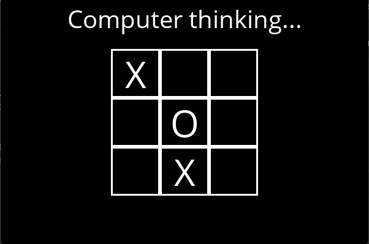

<h2 align="center"> 
  | TicTacToe with Minimax |
</h2>

[![School][school-shield]][school-url]
[![Contributors][contributors-shield]][contributors-url]
[![Issues][issues-shield]][issues-url]

## Overview:
This game use Pygame and Minimax algorithm.   
You will be able to play as X or O in a tic tac toe against an AI.

## Additional Information
As it has been recommended in the course, I have used deepcopy of the board. 
I also used two helper functions for minimax to avoid multiple lines of code for one function.

### Installation of required libraries

> pip install -r requirements.txt

### Launch Tic Tac Toe

> python runner.py

### Built With

* [Python](https://www.python.org)
* [Pygame](https://www.pygame.org/news)

### Acknowledgement

> Supervised by ??? (teacher at RTU)

> Project Link: [https://github.com/PhantHive/opti_project](https://github.com/PhantHive/tictactoe/)

<!-- MARKDOWN LINKS & IMAGES -->
[contributors-shield]: https://img.shields.io/github/contributors/PhantHive/tictactoe.svg?style=for-the-badge
[contributors-url]: https://github.com/PhantHive/tictactoe/graphs/contributors/

[issues-shield]: https://img.shields.io/github/issues/PhantHive/tictactoe.svg?style=for-the-badge
[issues-url]: https://github.com/PhantHive/tictactoe/issues/

[school-shield]: https://img.shields.io/badge/School-RTU-0B8844?&style=for-the-badge
[school-url]: https://www.rtu.lv
